# Week 11 Lab – Clickstream Analytics with Azure Stream Analytics

**CST8916 – Remote Data and Real-time Applications**

---

## What You Will Build

A real-time clickstream analytics pipeline that processes website visitor events using **Azure Stream Analytics**. You will send clickstream events to Event Hubs using the portal's **Data Explorer**, then write SAQL queries that filter, aggregate, and window those events in real-time — outputting results to **Azure Blob Storage**.

This lab picks up where Week 10 left off. In Week 10 you learned to **ingest** events into Event Hubs. This week you learn to **process** those events in real-time using Stream Analytics.

---

## Architecture

```mermaid
flowchart LR
    subgraph Producer["🐍 producer.py"]
        DE["📝 Python Script\n(Sends 3 batches\nof clickstream events)"]
    end

    subgraph EH["☁️ Azure Event Hubs"]
        NS["Namespace: clickanalytics"]
        Hub["Event Hub: clickstream"]
        NS --> Hub
    end

    subgraph ASA["☁️ Azure Stream Analytics"]
        direction TB
        Q1["Query 1: Filter\nmobile-only traffic"]
        Q2["Query 2: Aggregate\npageviews per 5 min"]
        Q3["Query 3: Hopping\nrolling average\npage load time"]
        Q4["Query 4: Sliding\nburst detection"]
        Q5["Query 5: Session\nuser session grouping"]
    end

    subgraph Output["☁️ Azure Blob Storage"]
        Blob["📦 Processed Results\n(JSON files)"]
    end

    DE -->|"send events"| EH
    EH -->|"streaming input"| ASA
    ASA -->|"output"| Output

    %% Colour palette
    style Producer fill:#FFF3E0,stroke:#E65100,color:#212121,stroke-width:2px
    style DE       fill:#FFF3E0,stroke:#E65100,color:#212121,stroke-width:2px
    style EH       fill:#F3E5F5,stroke:#6A1B9A,color:#212121,stroke-width:2px
    style NS       fill:#E1BEE7,stroke:#6A1B9A,color:#212121,stroke-width:1.5px
    style Hub      fill:#CE93D8,stroke:#6A1B9A,color:#212121,stroke-width:1.5px
    style ASA      fill:#E3F2FD,stroke:#1565C0,color:#212121,stroke-width:2px
    style Q1       fill:#BBDEFB,stroke:#1565C0,color:#212121,stroke-width:1.5px
    style Q2       fill:#BBDEFB,stroke:#1565C0,color:#212121,stroke-width:1.5px
    style Q3       fill:#BBDEFB,stroke:#1565C0,color:#212121,stroke-width:1.5px
    style Q4       fill:#BBDEFB,stroke:#1565C0,color:#212121,stroke-width:1.5px
    style Q5       fill:#BBDEFB,stroke:#1565C0,color:#212121,stroke-width:1.5px
    style Output   fill:#E8F5E9,stroke:#2E7D32,color:#212121,stroke-width:2px
    style Blob     fill:#C8E6C9,stroke:#2E7D32,color:#212121,stroke-width:1.5px
```



### Pipeline Summary

| Stage | Component | Role |
|-------|-----------|------|
| **Produce** | `producer.py` (Python script) | Send 3 batches of clickstream events to Event Hubs with randomized fields |
| **Ingest** | Azure Event Hubs | Buffer and deliver events to downstream consumers |
| **Process** | Azure Stream Analytics | Run continuous SAQL queries — filter, aggregate, window |
| **Store** | Azure Blob Storage | Persist processed results as JSON files |

---

## Connection to Week 10

In Week 10 you built a Flask app that **produced** clickstream events and **consumed** them in real-time. You saw how Event Hubs acts as a durable buffer between producers and consumers.

This week, **Azure Stream Analytics replaces your Flask consumer**. Instead of reading events in Python code, you write SQL-like queries that run continuously on the stream:

```
Week 10                              Week 11
┌──────────────────┐                ┌──────────────────────┐
│  Flask Producer   │                │  producer.py          │
│  (sends events)   │                │  (sends events)       │
│                   │──→ Event ──→  │                       │
│  Flask Consumer   │    Hubs       │  Stream Analytics     │
│  (Python code)    │←──            │  (SAQL queries)       │──→ Blob Storage
└──────────────────┘                └──────────────────────┘

Week 10: You wrote Python to both produce AND consume events
Week 11: You write Python to produce, but SQL to process — Stream Analytics replaces the consumer
```

---

## The Clickstream Dataset

Each event represents a single user interaction on a website. Here is the schema:

```json
{
    "timeStamp": "2026-03-24 9:30:20",
    "ipAddress": "123.45.60.45",
    "userId": "469b775c-6ab0-48ce-b321-08dc26c3b6cf",
    "sessionId": "a7f4b4bb-1107-4a35-b1dd-fb666de8edc7",
    "path": "/.netlify/functions/registration",
    "queryParameters": "?token=12345-ABCD",
    "referrerUrl": "http://example.com/about.html",
    "os": "Windows",
    "browser": "Chrome",
    "timeToCompletePage": 2100,
    "deviceType": "phone",
    "isLead": 1,
    "eventFirstTimestamp": 365476,
    "eventDuration": 1000,
    "eventScore": 95,
    "diagnostics": ""
}
```

### Field Reference

| Field | Type | Description |
|-------|------|-------------|
| `timeStamp` | string | When the event occurred (event time) — used by `TIMESTAMP BY` for windowing |
| `ipAddress` | string | Visitor's IP address |
| `userId` | string (UUID) | Unique identifier for the user |
| `sessionId` | string (UUID) | Groups events from the same browsing session |
| `path` | string | The page or endpoint the user visited |
| `queryParameters` | string | URL query string (e.g., tracking tokens) |
| `referrerUrl` | string | The page the user came from |
| `os` | string | Operating system (Windows, macOS, Linux, Android, iOS) |
| `browser` | string | Browser name (Chrome, Firefox, Safari, Edge) |
| `timeToCompletePage` | int | Page load time in milliseconds |
| `deviceType` | string | Device category: `phone`, `tablet`, or `desktop` |
| `isLead` | int (0 or 1) | Whether this user is a qualified lead (1 = yes, 0 = no) |
| `eventFirstTimestamp` | int | Internal event sequencing timestamp (ms) |
| `eventDuration` | int | How long the user spent on the page (ms) |
| `eventScore` | int | Engagement score (0–100) |
| `diagnostics` | string | Diagnostic info (empty when no issues) |

---

## Prerequisites

- **Python 3.x** and pip installed
- An **Azure account** (free tier is fine)
- A web browser (Azure Portal)

---

## Part 1: Create Azure Resources

You will create three resources: an Event Hubs namespace, a Stream Analytics job, and a Storage account.

### Step 1 – Create a Resource Group

1. Go to [portal.azure.com](https://portal.azure.com) and sign in.
2. Search for **Resource groups** in the top search bar.
3. Click **Create**.
4. Fill in:
   - **Subscription:** your subscription
   - **Resource group name:** `cst8916-week11-rg`
   - **Region:** `Canada Central`
5. Click **Review + create** → **Create**.

### Step 2 – Create an Event Hubs Namespace and Event Hub

1. Search for **Event Hubs** in the top search bar → click **Create**.
2. Fill in:
   - **Resource group:** `cst8916-week11-rg`
   - **Namespace name:** `clickanalytics-<your-name>` (must be globally unique)
   - **Region:** `Canada Central`
   - **Pricing tier:** `Basic`
3. Click **Review + create** → **Create**.
4. Once deployed, go to the resource.
5. Click **+ Event Hub** in the top toolbar.
6. Fill in:
   - **Name:** `clickstream`
   - **Partition count:** `2`
   - **Message retention:** `1` day
7. Click **Create**.

```
Event Hubs Namespace: clickanalytics-<your-name>
└── Event Hub: clickstream
    ├── Partition 0
    └── Partition 1
```

8. Go to **Shared access policies** (left menu) → click **RootManageSharedAccessKey**.
9. Copy the **Primary connection string** — you will need it in Part 3 to run the producer script.

> **Security note:** A connection string contains a secret key. Never commit it to Git. You will store it as an environment variable.

### Step 3 – Create a Storage Account (for output)

1. Search for **Storage accounts** → click **Create**.
2. Fill in:
   - **Resource group:** `cst8916-week11-rg`
   - **Storage account name:** `cst8916week11<your-name>` (lowercase, no hyphens, globally unique)
   - **Region:** `Canada Central`
   - **Performance:** Standard
   - **Redundancy:** Locally-redundant storage (LRS)
3. Click **Review + create** → **Create**.
4. Once deployed, go to the resource.
5. In the left menu, click **Containers** (under **Data storage**).
6. Click **+ Container** and create a container named `stream-output`.

### Step 4 – Create a Stream Analytics Job

1. Search for **Stream Analytics jobs** → click **Create**.
2. Fill in:
   - **Resource group:** `cst8916-week11-rg`
   - **Name:** `clickstream-analytics-<your-name>`
   - **Region:** `Canada Central`
   - **Hosting environment:** Cloud
   - **Streaming units:** `1` (minimum — sufficient for this lab)
3. Click **Review + create** → **Create**.
4. Once deployed, go to the resource.

---

## Part 2: Configure Stream Analytics Input and Output

### Step 1 – Add the Event Hub as Input

1. In your Stream Analytics job, click **Inputs** in the left menu (under **Job topology**).
2. Click **Add input** → **Event Hub**.
3. Fill in:
   - **Input alias:** `clickstream-input`
   - **Subscription:** your subscription
   - **Event Hub namespace:** `clickanalytics-<your-name>`
   - **Event Hub name:** `clickstream`
   - **Event Hub consumer group:** `$Default`
   - **Authentication mode:** Connection string
   - **Event serialization format:** JSON
   - **Encoding:** UTF-8
4. Click **Save**.

### Step 2 – Add Blob Storage as Output

1. Click **Outputs** in the left menu.
2. Click **Add output** → **Blob storage/ADLS Gen2**.
3. Fill in:
   - **Output alias:** `blob-output`
   - **Subscription:** your subscription
   - **Storage account:** `cst8916week11<your-name>`
   - **Container:** `stream-output`
   - **Authentication mode:** Connection string
   - **Event serialization format:** JSON
   - **Encoding:** UTF-8
   - **Format:** Line separated
4. Click **Save**.

```
Stream Analytics Job: clickstream-analytics
├── Input:  clickstream-input  ← reads from Event Hubs
├── Query:  (you will write this next)
└── Output: blob-output        ← writes to Blob Storage
```

---

## Part 3: Send Clickstream Events with the Producer Script

Instead of sending events manually through the Azure Portal, you will run a Python script (`producer.py`) that sends three batches of realistic clickstream events to your Event Hub. Each batch simulates a different type of website traffic.

### Step 1 – Install dependencies

```bash
cd 26W_CST8916_Week11-Stream-Analytics-Lab
pip install -r requirements.txt
```

This installs the `azure-eventhub` SDK — the same library used in Week 10.

### Step 2 – Set environment variables

You need the connection string from Part 1 (Step 2, **Shared access policies** → **RootManageSharedAccessKey** → **Primary connection string**).

**Linux / macOS:**
```bash
export EVENT_HUB_CONNECTION_STR="Endpoint=sb://clickanalytics-<your-name>.servicebus.windows.net/;SharedAccessKeyName=RootManageSharedAccessKey;SharedAccessKey=<your-key>"
export EVENT_HUB_NAME="clickstream"
```

**Windows (PowerShell):**
```powershell
$env:EVENT_HUB_CONNECTION_STR="Endpoint=sb://clickanalytics-<your-name>.servicebus.windows.net/;SharedAccessKeyName=RootManageSharedAccessKey;SharedAccessKey=<your-key>"
$env:EVENT_HUB_NAME="clickstream"
```

> **Security reminder:** Never put connection strings in your code or commit them to Git. Environment variables keep secrets out of source control.

### Step 3 – Run the producer

```bash
python producer.py
```

The script sends **35 events** in three batches with a 30-second pause between each batch:

```
CST8916 Week 11 – Clickstream Event Producer
============================================================
  Event Hub:  clickstream
  Batches:    3
  Pause:      30s between batches

============================================================
  Batch 1 – Mobile users, high engagement
  Sending 10 events...
  deviceType=phone, eventScore=95, isLead=1
============================================================

  Sample event:
  {
      "timeStamp": "2026-03-24 14:30:15",
      "ipAddress": "142.87.201.55",
      "userId": "a7f4b4bb-1107-4a35-b1dd-fb666de8edc7",
      "sessionId": "e3c8f92a-5d14-4b28-9c71-2a8b6e4f1d03",
      "path": "/products/phones",
      "browser": "Chrome",
      "timeToCompletePage": 2847,
      "deviceType": "phone",
      "eventScore": 95,
      "isLead": 1,
      ...
  }

  ✓ 10 events sent successfully!

  Waiting 30 seconds before next batch...

============================================================
  Batch 2 – Desktop users, medium engagement
  ...
============================================================

  ...

============================================================
  All batches sent!
============================================================
```

### What the producer sends

The script generates events with **randomized** dynamic fields (`timeStamp`, `userId`, `ipAddress`, `sessionId`, `browser`, `timeToCompletePage`, `path`) and **fixed** group fields (`deviceType`, `eventScore`, `isLead`) per batch:

| Batch | Count | deviceType | eventScore | isLead | Page load range | Pages |
|-------|-------|------------|-----------|--------|----------------|-------|
| 1 – Mobile, high engagement | 10 | `phone` | 95 | `1` | 1500–4000 ms | Product pages |
| 2 – Desktop, medium engagement | 10 | `desktop` | 85 | `1` | 800–2500 ms | Pricing/enterprise pages |
| 3 – Mobile, low engagement | 15 | `phone` | 22 | `0` | 3000–7000 ms | Blog/support pages |

Each batch's events have timestamps spread across a **30-second window** (using the current UTC time as the base). Batches are offset by **2 minutes** from each other so they land in different time windows when you run your SAQL queries.

> **Why randomize?** Fixed-value batches (like the Data Explorer's Repeat send) produce identical events — every row has the same `userId`, `path`, and `timeToCompletePage`. The producer script randomizes these fields so that aggregation functions (`AVG`, `MIN`, `MAX`, `COUNT`) produce meaningful, varied results while keeping the group fields consistent for clear filtering and GROUP BY behavior.

---

## Part 4: Write and Test SAQL Queries

Now comes the core of this lab. You will write SAQL queries in the Stream Analytics query editor and test them against the events you sent.

### Open the Query Editor

1. Go to your Stream Analytics job → click **Query** in the left menu (under **Job topology**).
2. The query editor opens with a default template. You will replace it with the queries below.

> **Important:** You can test queries without starting the job by using the **Test query** feature. Click **Test query** to run your query against recent events in the input.

---

### Query 1: Pass-through (See All Events)

Start simple — forward all events to the output without any transformation.

```sql
SELECT *
FROM [clickstream-input]
```

**What it does:** Selects every field from every event and sends it to the output. This is useful for verifying that your input is connected correctly and events are flowing.

**Try it:** Click **Test query**. You should see all 35 events in the results pane — each with a unique `userId`, `ipAddress`, `path`, and `timeToCompletePage`.

---

### Query 2: Filtering — Mobile Traffic Only

Filter the stream to only include events from mobile devices (phones and tablets).

```sql
SELECT userId,
       deviceType,
       path,
       browser,
       eventScore,
       timeStamp
FROM [clickstream-input]
WHERE deviceType IN ('phone', 'tablet')
```

**What it does:**
- `WHERE deviceType IN ('phone', 'tablet')` keeps only phone and tablet events — everything else is dropped
- `SELECT` picks only the fields we care about (projection) instead of forwarding everything

**Expected result:** 25 events — all 10 from Batch 1 (`phone`) and all 15 from Batch 3 (`phone`). All 10 events from Batch 2 (`desktop`) are **filtered out**.

**Real-world use:** A marketing team wants a separate feed of mobile-only traffic to analyze mobile user behavior and optimize the mobile experience.

---

### Query 3: Filtering + Computed Columns — High-Value Leads

Find qualified leads with high engagement and compute a "priority" label.

```sql
SELECT userId,
       path,
       eventScore,
       timeToCompletePage,
       CASE
           WHEN eventScore >= 90 THEN 'HOT'
           WHEN eventScore >= 60 THEN 'WARM'
           ELSE 'COLD'
       END AS leadPriority,
       timeStamp
FROM [clickstream-input]
WHERE isLead = 1
  AND eventScore > 50
```

**What it does:**
- Filters to only events where `isLead = 1` (is a lead) AND `eventScore > 50`
- Uses a `CASE` expression to classify leads into priority tiers — this is a **computed column** that does not exist in the original event

**Expected result:** 20 events — Batch 1 (10 events, `isLead = 1`, `eventScore = 95`) appear with `leadPriority = HOT`. Batch 2 (10 events, `isLead = 1`, `eventScore = 85`) appear with `leadPriority = WARM`. Batch 3 is filtered out entirely because `isLead = 0`.

**Real-world use:** A sales team receives only high-value leads in real-time, pre-classified by priority, so they can follow up immediately on HOT leads.

---

### Query 4: Tumbling Window — Pageviews Per Minute

Count the total number of pageviews and average engagement score per 1-minute window.

```sql
SELECT COUNT(*) AS totalPageviews,
       AVG(eventScore) AS avgEngagement,
       MIN(eventScore) AS minEngagement,
       MAX(eventScore) AS maxEngagement,
       System.Timestamp() AS windowEnd
FROM [clickstream-input]
TIMESTAMP BY CAST(timeStamp AS datetime)
GROUP BY TumblingWindow(minute, 1)
```

**What it does:**
- `TIMESTAMP BY CAST(timeStamp AS datetime)` tells ASA to use the `timeStamp` field from the event as the official time (not the arrival time). The `CAST` is needed because our timestamp is a string, not a native datetime.
- `TumblingWindow(minute, 1)` groups events into non-overlapping 1-minute buckets
- `System.Timestamp()` returns the end time of each window
- Aggregation functions (`COUNT`, `AVG`, `MIN`, `MAX`) compute across all events in each window

**Expected result:** Three rows, one per 1-minute window — Batch 1 (10 events at 10:00) in one window, Batch 2 (10 events at 10:02) in another, and Batch 3 (15 events at 10:05) in a third. The `avgEngagement` values should be 95, 85, and 22 respectively — matching each batch's `eventScore`.

**Real-world use:** A live dashboard that updates every minute showing overall site activity — how many visitors, how engaged they are.

> **Key concept — TIMESTAMP BY:** Without this clause, ASA uses the time the event arrived at Event Hubs (arrival time). With it, ASA uses the time embedded in the event itself (event time). This matters because events can arrive late due to network delays. See the SAQL Reference for a detailed explanation.

---

### Query 5: Tumbling Window + GROUP BY — Pageviews by Device Type

Break down pageviews by device type in 2-minute windows.

```sql
SELECT deviceType,
       COUNT(*) AS pageviews,
       AVG(CAST(timeToCompletePage AS float)) AS avgLoadTime,
       AVG(CAST(eventScore AS float)) AS avgScore,
       System.Timestamp() AS windowEnd
FROM [clickstream-input]
TIMESTAMP BY CAST(timeStamp AS datetime)
GROUP BY deviceType, TumblingWindow(minute, 2)
```

**What it does:**
- Groups by **both** `deviceType` and a 2-minute tumbling window
- This means you get one row per device type per window — e.g., one row for `phone` and one for `desktop` for each 2-minute period
- `AVG(CAST(timeToCompletePage AS float))` computes the average page load time per group

**Expected result:** Three rows — one per device type per window. Batch 1 produces a `phone` row (10 pageviews, avgLoadTime between 1500–4000, avgScore = 95). Batch 2 produces a `desktop` row (10 pageviews, avgLoadTime between 800–2500, avgScore = 85). Batch 3 produces another `phone` row in a later window (15 pageviews, avgLoadTime between 3000–7000, avgScore = 22).

**Real-world use:** An operations team monitors page load times by device type. If mobile load times spike, they investigate mobile-specific issues.

---

### Query 6: Hopping Window — Rolling Average Page Load Time

Compute a rolling 4-minute average page load time, updated every 2 minutes.

```sql
SELECT AVG(CAST(timeToCompletePage AS float)) AS rollingAvgLoadTime,
       COUNT(*) AS eventCount,
       System.Timestamp() AS windowEnd
FROM [clickstream-input]
TIMESTAMP BY CAST(timeStamp AS datetime)
GROUP BY HoppingWindow(minute, 4, 2)
```

**What it does:**
- `HoppingWindow(minute, 4, 2)` creates windows that are **4 minutes long** and a new window starts every **2 minutes**
- Windows overlap — an event can appear in two consecutive windows
- This produces a **smoother** average than a tumbling window because each result includes events from the current and previous periods

```
Time:    9:30    9:32    9:34    9:36
         |───────4 min───────|
                 |───────4 min───────|
                         |───────4 min───────|
         |←2 min→|
           (hop)
```

**Real-world use:** A performance monitoring dashboard that shows a smoothed-out average load time, reducing the noise of individual spikes.

> **Tumbling vs Hopping:** A tumbling window gives you distinct, non-overlapping snapshots. A hopping window gives you overlapping, smoothed results. When the hop size equals the window size, a hopping window becomes a tumbling window.

---

### Query 7: Sliding Window — Burst Detection

Detect when there are more than 3 events within any 2-minute sliding window — a potential traffic burst.

```sql
SELECT COUNT(*) AS burstCount,
       AVG(CAST(eventScore AS float)) AS avgScore,
       System.Timestamp() AS windowEnd
FROM [clickstream-input]
TIMESTAMP BY CAST(timeStamp AS datetime)
GROUP BY SlidingWindow(minute, 2)
HAVING COUNT(*) > 3
```

**What it does:**
- `SlidingWindow(minute, 2)` creates a window that recalculates every time an event **enters or exits** the 2-minute lookback
- Unlike tumbling and hopping windows, sliding windows are **not on a fixed schedule** — they fire based on event activity
- `HAVING COUNT(*) > 3` is a **post-aggregation filter** — it only outputs a result when the condition is met (more than 3 events in the window)

**The difference between WHERE and HAVING:**
- `WHERE` filters **individual events** before aggregation — "only include events where temperature > 100"
- `HAVING` filters **aggregated results** after grouping — "only show groups where the count is more than 3"

**Real-world use:** An alerting system that detects sudden traffic bursts — possibly a viral link, a bot attack, or a successful marketing campaign going live.

---

## Part 5: Run the Stream Analytics Job

Now that you have tested your queries individually, pick **one query** to run as a live job.

### Step 1 – Set the final query

1. Go to your Stream Analytics job → **Query**.
2. Paste the following query (Query 5 — Pageviews by Device Type). This is a good choice because it uses tumbling windows and GROUP BY, producing clear, easy-to-verify output:

```sql
SELECT deviceType,
       COUNT(*) AS pageviews,
       AVG(CAST(timeToCompletePage AS float)) AS avgLoadTime,
       AVG(CAST(eventScore AS float)) AS avgScore,
       System.Timestamp() AS windowEnd
INTO [blob-output]
FROM [clickstream-input]
TIMESTAMP BY CAST(timeStamp AS datetime)
GROUP BY deviceType, TumblingWindow(minute, 2)
```

> **Notice the `INTO [blob-output]` clause.** When testing queries, ASA shows results in the browser. When running a live job, you must specify where the output goes using `INTO`. This directs results to the Blob Storage output you configured in Part 2.

3. Click **Save query**.

### Step 2 – Start the job

1. Go to the **Overview** page of your Stream Analytics job.
2. Click **Start** in the top toolbar.
3. For **Job output start time**, select **Now**.
4. Click **Start**. The job takes 1-2 minutes to begin processing.

### Step 3 – Send more events

1. Open a terminal and run the producer script again:
   ```bash
   python producer.py
   ```
2. Wait 2-3 minutes after the script finishes for the tumbling windows to close and results to be written.

### Step 4 – Check the output in Blob Storage

1. Go to your Storage account → **Containers** → `stream-output`.
2. You should see folders organized by date and time.
3. Navigate into the folders and download the JSON file.
4. Open it — you should see the aggregated results: one row per device type per 2-minute window.

Example output (your `avgLoadTime` and `windowEnd` values will differ):
```json
{"deviceType":"phone","pageviews":10,"avgLoadTime":2847.5,"avgScore":95.0,"windowEnd":"2026-03-24T14:32:00.0000000Z"}
{"deviceType":"desktop","pageviews":10,"avgLoadTime":1623.8,"avgScore":85.0,"windowEnd":"2026-03-24T14:34:00.0000000Z"}
{"deviceType":"phone","pageviews":15,"avgLoadTime":4912.3,"avgScore":22.0,"windowEnd":"2026-03-24T14:36:00.0000000Z"}
```

> **Stop the job when done.** Stream Analytics charges per Streaming Unit per hour. Go to **Overview** → **Stop** to avoid unnecessary costs.

---

## Windowing Functions Recap

This lab demonstrated three types of windows. Here is how they compare:

| Window Type | Query | Overlap | Trigger | Used For |
|-------------|-------|---------|---------|----------|
| **Tumbling** | Queries 4, 5 | None | Fixed interval | Regular periodic aggregations |
| **Hopping** | Query 6 | Yes | Fixed interval | Smoothed rolling averages |
| **Sliding** | Query 7 | Yes | Event arrival/departure | Burst and threshold detection |

```
Time ──────────────────────────────────────────→

Tumbling:    |  Window 1  |  Window 2  |  Window 3  |
             No overlap, no gaps

Hopping:     |  Window 1     |
                |  Window 2     |
                   |  Window 3     |
             Overlapping windows

Sliding:         |  Window  |
             Triggered only when events enter/exit
```

